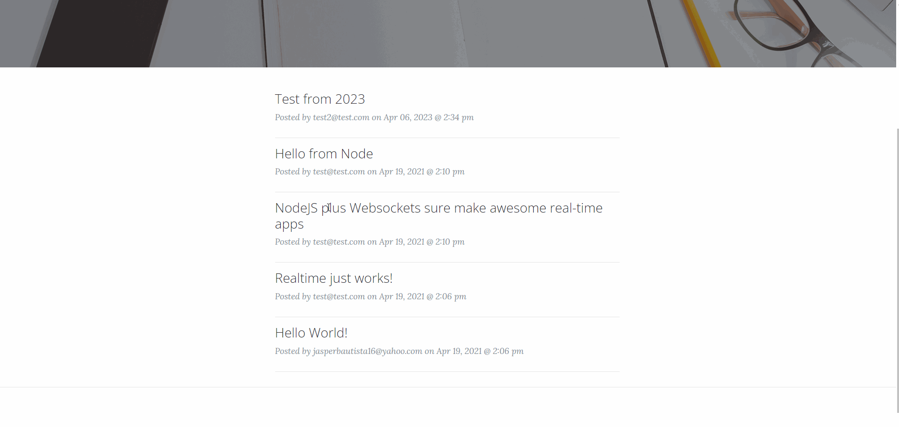

# node-simple-social-media
A dead simple social media powered by Node and Socket.io

## Preview




## Installation

1. Make sure you have Node.js installed on your local machine
2. Clone this repo
3. Create a .env file in the root with these fields
```
NODE_ENV=local
PORT=3000
MONGO_DB_CONNECTION=your MongoDB uri
JWT_SECRET=ultrasecretsecretkey
```
5. Navigate to the created folder via terminal and run `npm install`
6. Afterwards, run `npm start` until the server listens at port 3000
7. Go to your browser and type in http://localhost:3000/


## Features

* User authentication with JWT (login and register)
* Post statuses real-time!
* Status feed
* Uses vanilla javascript
